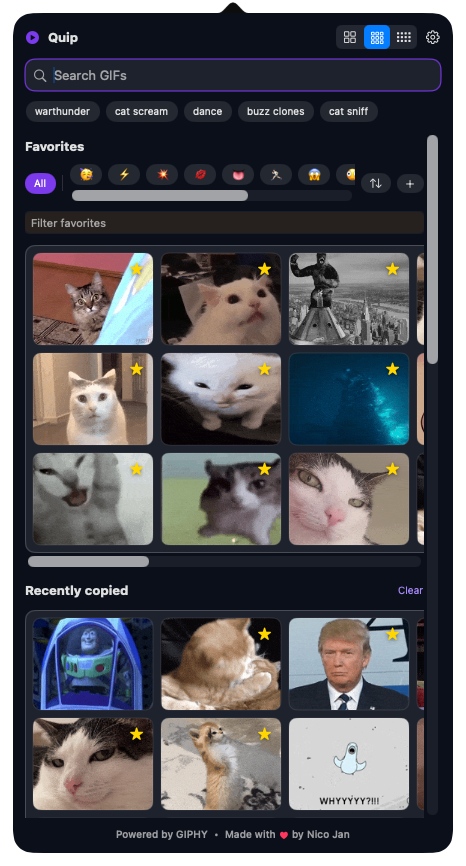
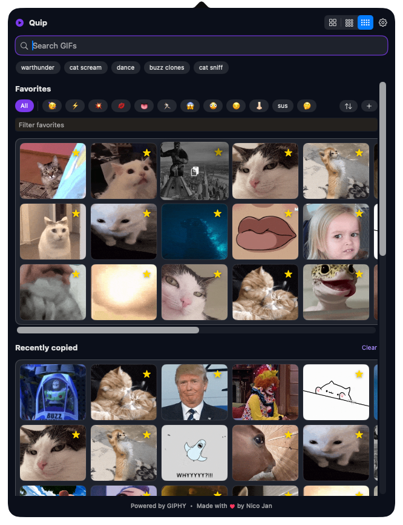

# Quip

Quip is a macOS menu-bar app for finding a GIF and dropping it into whatever
you're typing. Search, click, paste. It lives in the menu bar, keeps your
favorites and the GIFs you've already used close by, and runs on your own free
Giphy key so it never sits behind someone else's rate limit.

Quip is a sibling to [Chorus](https://github.com/nicojan/Chorus): a small native
Mac app for Apple Silicon that's signed and notarized, with Sparkle updates.

<p align="center">
  
  &nbsp;&nbsp;
  
</p>

## Features

- **Search and copy.** Search Giphy from the menu bar and click any result to
  copy it to the clipboard as an animated file. Paste it into Messages, Slack,
  or anywhere that takes an image.
- **Favorites.** Star a GIF to keep it one click away.
- **Recently copied.** Quip remembers the GIFs you actually used.
- **Recent searches.** Click a past search to run it again.
- **Collections.** Group favorites into named buckets, give each one an emoji,
  reorder them, and sort them A to Z.
- **Three sizes.** Switch between two, three, and five GIFs per row, all the same
  height, so pick the width you like.
- **Start at login** and **in-app updates** through Sparkle.

## Bring your own Giphy key

Quip ships without an API key. You use your own free key, so no one shares a
rate limit:

1. Open the [Giphy developers dashboard](https://developers.giphy.com/dashboard/)
   and sign in.
2. Create an app and choose the **API** option (not the SDK — Giphy nudges you
   toward it, but Quip needs a plain API key), then copy the key.
3. Open Quip's **Settings** and paste the key into the **Giphy API Key** field.

The key stays on your Mac. Until you add one, search asks you for it.

## Requirements

macOS 14.6 or later.

## Build & run

The Xcode project is generated from `project.yml` with
[XcodeGen](https://github.com/yonaskolb/XcodeGen).

```sh
# Regenerate the Xcode project after changing project.yml or adding files
xcodegen generate

# Build and test from the command line
xcodebuild -project Quip.xcodeproj -scheme Quip -destination 'platform=macOS' test
```

Sparkle and SDWebImageSwiftUI resolve through Swift Package Manager.

## Project layout

```
Quip/            App, Views, ViewModels, Services, Models, Support, Assets
QuipTests/       unit tests for the Giphy client and the GIF library
project.yml      XcodeGen source of truth for the Xcode project
docs/            design notes and the Sparkle appcast (served by GitHub Pages)
release/         distribution runbook and export options
scripts/         make_icon.py regenerates the app icon
```

## Distribution

Direct download: a Developer ID-signed, notarized `.dmg`, with Sparkle handling
updates. It runs outside the App Sandbox and installs from a download rather than
the Mac App Store. See [`release/DISTRIBUTION.md`](release/DISTRIBUTION.md).

## License

MIT. See [LICENSE](LICENSE). GIF search is powered by GIPHY.
